```mermaid
graph TB
    A[Frontend<br>React + Vite] --> B[Backend API<br>Flask + JWT]
    B --> C[Database<br>PostgreSQL]
    B --> D[File Storage<br>AWS S3]
    B --> E[Authentication<br>JWT Tokens]
    
    F[User Browser] --> A
    G[Mobile Devices] --> A
    
    subgraph "Data Flow"
        H[Business Data] --> C
        I[File Uploads] --> D
    end
    
    style A fill:#61dafb
    style B fill:#000000
    style C fill:#336791
    style D fill:#ff9900
```

# 📊 InsightPulse – Business Analytics Dashboard

<div align="center">

**Transform Data into Decisions with Real-Time Business Intelligence** 📈


*Visualize • Analyze • Optimize*

</div>

## 🚀 Overview

**InsightPulse** is a modern full-stack business analytics platform that empowers organizations to visualize real-time metrics, securely manage documents, and gain intelligent insights through an intuitive, responsive dashboard.

### 🎯 Why InsightPulse?

- 📊 **Real-Time Analytics** - Live business metrics with interactive visualizations
- 🔒 **Enterprise Security** - JWT authentication & AWS S3 secure file storage
- 📱 **Responsive Design** - Seamless experience across all devices
- ⚡ **High Performance** - Optimized for fast data processing and rendering
- 🎨 **Beautiful UI** - Modern, clean interface built with TailwindCSS

## 🏗️ System Architecture



## 🛠️ Tech Stack

### 🔙 Backend (Flask Microservices)
- **Python 3.11+** - Core programming language
- **Flask 3.0** - Lightweight web framework
- **Flask-JWT-Extended** - Secure token-based authentication
- **SQLAlchemy ORM** - Database abstraction layer
- **PostgreSQL** - Robust relational database
- **Boto3** - AWS SDK for S3 integration
- **CORS** - Cross-origin resource sharing
- **python-dotenv** - Environment configuration

### 🔜 Frontend (React Ecosystem)
- **React 18** - Modern UI library with hooks
- **Vite** - Next-generation build tool
- **TailwindCSS** - Utility-first CSS framework
- **Recharts** - Composable charting library
- **Axios** - Promise-based HTTP client
- **React Router** - Declarative routing
- **Lucide React** - Beautiful icons

### ☁️ Cloud & Deployment
- **AWS S3** - Secure cloud file storage
- **Docker** - Containerization ready
- **Environment Variables** - Secure configuration management

## 📁 Project Structure

```
InsightPulse/
├── 📂 backend/
│   ├── 🐍 app.py                 # Flask application entry point
│   ├── ⚙️ config.py              # Environment & database configuration
│   ├── 📋 requirements.txt       # Python dependencies
│   ├── 📂 models/
│   │   └── 📊 metrics.py         # SQLAlchemy data models
│   ├── 📂 routes/
│   │   ├── 🔐 auth.py            # Authentication endpoints
│   │   ├── 📈 data.py            # Analytics & metrics API
│   │   └── ☁️ upload.py          # File upload handlers
│   ├── 📂 utils/
│   │   ├── 🗄️ db.py              # Database connection utilities
│   │   └── 📁 s3_helper.py       # AWS S3 integration helpers
│   └── 🔒 .env                   # Environment variables (local)
│
├── 📂 frontend/
│   ├── 📦 package.json           # Node.js dependencies
│   ├── ⚡ vite.config.js         # Vite build configuration
│   ├── 📂 src/
│   │   ├── 🎯 App.jsx            # Root React component
│   │   ├── 📂 components/
│   │   │   ├── 🏠 Dashboard.jsx  # Main analytics dashboard
│   │   │   ├── 🔍 FilterPanel.jsx # Data filtering controls
│   │   │   ├── 📊 ChartCard.jsx  # Reusable chart components
│   │   │   └── 🧭 Navbar.jsx     # Navigation header
│   │   ├── 📂 services/
│   │   │   └── 🌐 api.js         # Axios API service layer
│   │   └── 📂 styles/
│   │       └── 🎨 index.css      # Global TailwindCSS imports
│   └── 📄 index.html             # Application entry point
│
├── 📋 .env.example               # Environment template
├── 🚫 .gitignore                 # Git ignore rules
└── 📖 README.md                  # Project documentation
```

## 🔌 API Documentation

### 🔐 Authentication Endpoints

| Method | Endpoint | Description | Auth Required |
|--------|----------|-------------|---------------|
| `POST` | `/api/auth/login` | User authentication | ❌ |
| `POST` | `/api/auth/refresh` | Refresh JWT token | ✅ |
| `POST` | `/api/auth/logout` | User logout | ✅ |

### 📊 Analytics Endpoints

| Method | Endpoint | Description | Auth Required |
|--------|----------|-------------|---------------|
| `GET` | `/api/data/metrics` | Fetch business metrics | ✅ |
| `GET` | `/api/data/kpi-summary` | Get KPI overview | ✅ |
| `POST` | `/api/data/seed-demo` | Seed demo data | ✅ |

### 📁 File Management Endpoints

| Method | Endpoint | Description | Auth Required |
|--------|----------|-------------|---------------|
| `POST` | `/api/upload/file` | Upload to S3 | ✅ |
| `GET` | `/api/upload/files` | List user files | ✅ |
| `DELETE` | `/api/upload/files/{id}` | Delete file | ✅ |

## 🚀 Quick Start Guide

### Prerequisites
- **Python 3.11+** & **Node.js 18+**
- **PostgreSQL** database
- **AWS Account** (for S3 storage)

### 🛠️ Backend Setup

1. **Navigate to backend directory**
   ```bash
   cd backend
   ```

2. **Create virtual environment**
   ```bash
   python -m venv venv
   # Windows
   venv\Scripts\activate
   # Mac/Linux
   source venv/bin/activate
   ```

3. **Install dependencies**
   ```bash
   pip install -r requirements.txt
   ```

4. **Configure environment**
   ```bash
   cp .env.example .env
   # Edit .env with your configurations
   ```

5. **Run Flask application**
   ```bash
   python app.py
   ```
   ✅ **Backend running at:** `http://localhost:5000`

### 💻 Frontend Setup

1. **Navigate to frontend directory**
   ```bash
   cd frontend
   ```

2. **Install dependencies**
   ```bash
   npm install
   ```

3. **Start development server**
   ```bash
   npm run dev
   ```
   ✅ **Frontend running at:** `http://localhost:5173`

## 🎯 Key Features

### 📈 Advanced Analytics
- **Real-time KPI Tracking** - Monitor key business metrics
- **Interactive Charts** - Line, bar, and pie charts with Recharts
- **Custom Date Ranges** - Filter data by specific time periods
- **Segment Analysis** - Drill down by user segments or departments

### 🔐 Security & Authentication
- **JWT Token Management** - Secure stateless authentication
- **Protected Routes** - Role-based access control
- **Secure File Uploads** - AWS S3 with signed URLs
- **CORS Configuration** - Cross-origin security

### ☁️ Cloud Integration
- **AWS S3 Storage** - Secure and scalable file storage
- **Auto-scaling Ready** - Containerized deployment ready
- **Environment-based Configs** - Different settings per environment

### 📱 User Experience
- **Responsive Design** - Mobile-first approach
- **Dark/Light Mode** - Theme support (planned)
- **Loading States** - Smooth user experience
- **Error Handling** - Graceful error management

## 🧪 Demo Usage

1. **Access Application** - Open `http://localhost:5173`
2. **Auto Login** - Demo credentials pre-configured
3. **Seed Data** - Click "Seed Demo Data" in navigation
4. **Explore Dashboard** - Interact with charts and filters
5. **Upload Files** - Test S3 integration with document uploads

## 🚧 Future Roadmap

### 🎯 Short Term (v1.1)
- [ ] **Multi-tenant Support** - Organization-based data isolation
- [ ] **Advanced Filters** - Multi-dimensional data filtering
- [ ] **Export Functionality** - PDF/Excel report generation
- [ ] **Real-time Updates** - WebSocket integration

### 🔮 Long Term (v2.0)
- [ ] **Machine Learning** - Predictive analytics
- [ ] **Custom Dashboards** - Drag-and-drop widget system
- [ ] **Mobile App** - React Native companion app
- [ ] **API Marketplace** - Third-party integrations

## 🤝 Contributing

We love contributions! Here's how to help:

1. **Fork the repository**
2. **Create a feature branch** (`git checkout -b feature/amazing-feature`)
3. **Commit your changes** (`git commit -m 'Add amazing feature'`)
4. **Push to branch** (`git push origin feature/amazing-feature`)
5. **Open a Pull Request**

### Development Guidelines
- Follow PEP 8 for Python code
- Use ESLint for JavaScript/React
- Write meaningful commit messages
- Add tests for new features

## 🐛 Troubleshooting

### Common Issues

**Database Connection Failed**
```bash
# Ensure PostgreSQL is running
sudo service postgresql start

# Create database
createdb insightpulse
```

**Module Not Found Errors**
```bash
# Reinstall dependencies
pip install -r requirements.txt
npm install
```

**S3 Upload Fails**
- Verify AWS credentials in `.env`
- Check S3 bucket permissions
- Validate CORS configuration on S3 bucket

## 👨‍💻 Author

**Sree Raksha S P**  
💻 Full Stack Developer & Data Enthusiast

[](https://linkedin.com/in/sreeraksha0123)
[](https://github.com/sreeraksha0123)
[](https://leetcode.com/u/sreeraksha0123/)


---

<div align="center">

### 🌟 **Built with precision, powered by data, designed for decisions.**

</div>
